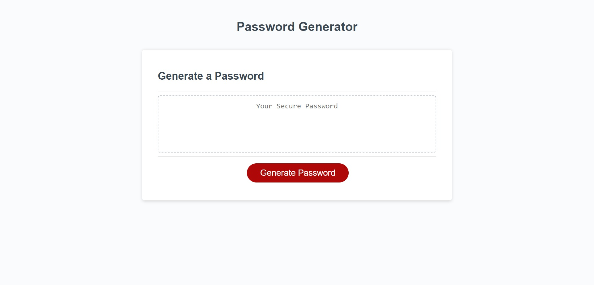

# Password Generator Challenge

## Description

This project is based on the javascript code of generating a password based on user choices.

This site contains a button that functions as a generator for creating passwords.

This will initiate a series of confirmations that will ask the user to select at least one criteria of lowercase,
uppercase, numbers, and special characters. If the user for some reason doesn't, an alert will appear letting
the user know that at least one critieria has to be true in order for the generation to work.

Once at least one criteria is true, the user will be the prompted to enter a password length between 8 and 128
characters. If not, then the user will be alerted that a valid number needs to be valid. The user will have to
start over. If all goes well, then the password should generate with a string that contains characters from
what the user picked.

## Screenshot

## Deployed Link

https://cazthetraveler.github.io/Password-Generator/